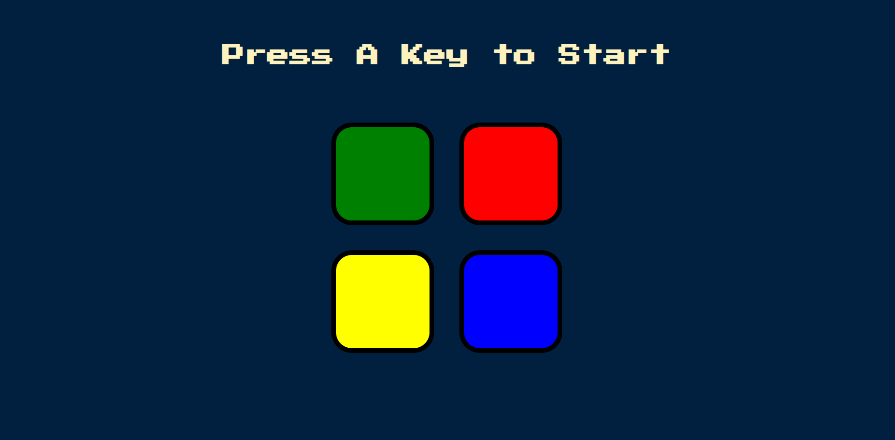

# Classic Simon Game
### 🌐 Visit Game: https://playsimonmemo.netlify.app/


#### Description 📝
 <p> This is a complicated JS project that combines JS and jQuery in a classic Simon game, with memory game logic </p>
 
#### Feutures 🎆
- Interactive
- responsive
- fun to play
- sound-based

#### Tech Stack 🚀
- HTML
- CSS
- JS
- JQ
### 🛠️ Installation

Follow these steps to get a local copy of We Try up and running on your machine.

### Prerequisites
* Make sure you have **Node.js** installed ([Download Node.js](https://nodejs.org))

### Setup Steps
Open your terminal and run the following commands:

```bash
git clone https://github.com/abrvion/simon-game.git
cd simon-game
npm install
node index.js
```
